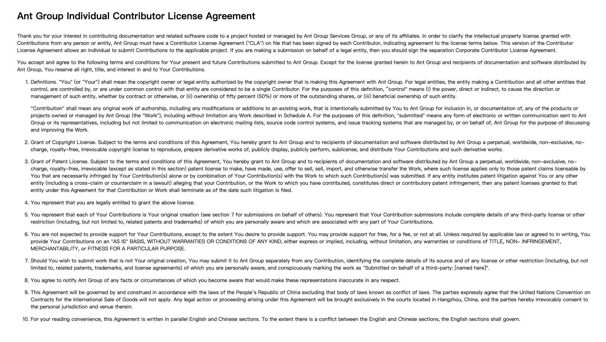

# Smart-Intermediate-Representation CLA



---

**Ant Group Individual Contributor License Agreement**

```
Thank you for your interest in contributing documentation and related software code to a project hosted or managed by Ant Group Services Group, or any of its affiliates. In order to clarify the intellectual property license granted with Contributions from any person or entity, Ant Group must have a Contributor License Agreement ("CLA") on file that has been signed by each Contributor, indicating agreement to the license terms below. This version of the Contributor License Agreement allows an individual to submit Contributions to the applicable project. If you are making a submission on behalf of a legal entity, then you should sign the separation Corporate Contributor License Agreement.

You accept and agree to the following terms and conditions for Your present and future Contributions submitted to Ant Group. Except for the license granted herein to Ant Group and recipients of documentation and software distributed by Ant Group, You reserve all right, title, and interest in and to Your Contributions.

1. Definitions. "You" (or "Your") shall mean the copyright owner or legal entity authorized by the copyright owner that is making this Agreement with Ant Group. For legal entities, the entity making a Contribution and all other entities that control, are controlled by, or are under common control with that entity are considered to be a single Contributor. For the purposes of this definition, “control" means (i) the power, direct or indirect, to cause the direction or management of such entity, whether by contract or otherwise, or (ii) ownership of fifty percent (50%) or more of the outstanding shares, or (iii) beneficial ownership of such entity.

"Contribution" shall mean any original work of authorship, including any modifications or additions to an existing work, that is intentionally submitted by You to Ant Group for inclusion in, or documentation of, any of the products or projects owned or managed by Ant Group (the "Work"), including without limitation any Work described in Schedule A. For the purposes of this definition, "submitted" means any form of electronic or written communication sent to Ant Group or its representatives, including but not limited to communication on electronic mailing lists, source code control systems, and issue tracking systems that are managed by, or on behalf of, Ant Group for the purpose of discussing and improving the Work.

2. Grant of Copyright License. Subject to the terms and conditions of this Agreement, You hereby grant to Ant Group and to recipients of documentation and software distributed by Ant Group a perpetual, worldwide, non-exclusive, no-charge, royalty-free, irrevocable copyright license to reproduce, prepare derivative works of, publicly display, publicly perform, sublicense, and distribute Your Contributions and such derivative works.

3. Grant of Patent License. Subject to the terms and conditions of this Agreement, You hereby grant to Ant Group and to recipients of documentation and software distributed by Ant Group a perpetual, worldwide, non-exclusive, no-charge, royalty-free, irrevocable (except as stated in this section) patent license to make, have made, use, offer to sell, sell, import, and otherwise transfer the Work, where such license applies only to those patent claims licensable by You that are necessarily infringed by Your Contribution(s) alone or by combination of Your Contribution(s) with the Work to which such Contribution(s) was submitted. If any entity institutes patent litigation against You or any other entity (including a cross-claim or counterclaim in a lawsuit) alleging that your Contribution, or the Work to which you have contributed, constitutes direct or contributory patent infringement, then any patent licenses granted to that entity under this Agreement for that Contribution or Work shall terminate as of the date such litigation is filed.

4. You represent that you are legally entitled to grant the above license.

5. You represent that each of Your Contributions is Your original creation (see section 7 for submissions on behalf of others). You represent that Your Contribution submissions include complete details of any third-party license or other restriction (including, but not limited to, related patents and trademarks) of which you are personally aware and which are associated with any part of Your Contributions.

6. You are not expected to provide support for Your Contributions, except to the extent You desire to provide support. You may provide support for free, for a fee, or not at all. Unless required by applicable law or agreed to in writing, You provide Your Contributions on an "AS IS" BASIS, WITHOUT WARRANTIES OR CONDITIONS OF ANY KIND, either express or implied, including, without limitation, any warranties or conditions of TITLE, NON- INFRINGEMENT, MERCHANTABILITY, or FITNESS FOR A PARTICULAR PURPOSE.

7. Should You wish to submit work that is not Your original creation, You may submit it to Ant Group separately from any Contribution, identifying the complete details of its source and of any license or other restriction (including, but not limited to, related patents, trademarks, and license agreements) of which you are personally aware, and conspicuously marking the work as "Submitted on behalf of a third-party: [named here]".

8. You agree to notify Ant Group of any facts or circumstances of which you become aware that would make these representations inaccurate in any respect.

9. This Agreement will be governed by and construed in accordance with the laws of the People’s Republic of China excluding that body of laws known as conflict of laws. The parties expressly agree that the United Nations Convention on Contracts for the International Sale of Goods will not apply. Any legal action or proceeding arising under this Agreement will be brought exclusively in the courts located in Hangzhou, China, and the parties hereby irrevocably consent to the personal jurisdiction and venue therein.

10. For your reading convenience, this Agreement is written in parallel English and Chinese sections. To the extent there is a conflict between the English and Chinese sections, the English sections shall govern.
```